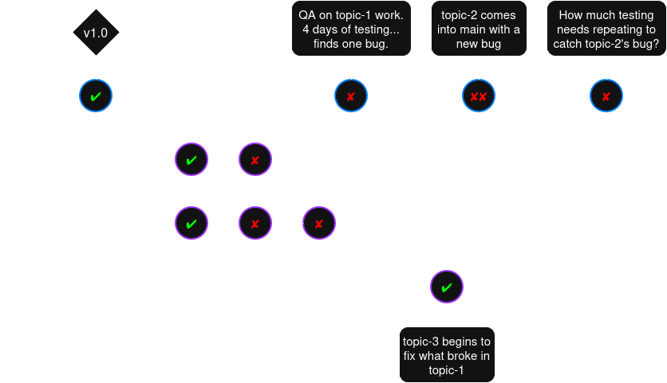

# Embedded Devops on Day One
First steps to a building firmware The Easier Way™

---

## Who's Presenting
### Mike Thielvoldt 

- 15 Years at startups with headcounts from [1 - 250+]
- Industries: [green tech](https://www.gradientcomfort.com/), [energy](https://lunarenergy.com), [powersport](), [special effects](https://livesparkfire.com), [Burning Man shit](https://www.lepidodgera.com/)
- Started as a Mechanical Engineer
- Led firmware efforts with up to 6-ish contributors
- Currently a freelance firmware: [MGT Firmware](https://mgtfirmware.com)

**Translation ➔** I have tech-debt battle scars, but fully accept that startups need to be lean and fast.

---

## Roadmap

1. Measure up the project
1. Make hard choices
1. Close the loop with CI
1. Add a unit test
1. Add your embedded toolchain
1. Automate an on-hardware test
1. Release it into the wild

---

## Glossary
**CI**: Continuous Integration: A development process involving requent contributions to a code repository, which trigger tests in the cloud to reveal issues early

**EE**: Electrical engineer(ing)

**FW**: Firmware

**MCU**: Microcontroller

**Onboarding**: Facilitating new team members in becoming effective contributors

**QA**: Quality Assurance.  A team that tests software, and may also write it

**PR**: Pull Request.  A process where a branch is tested and reviewed before it gets merged

**Refactor**: Code changes that improve maintainability, but don't add features

**Regression**: A release breaks something that wasn’t broken before

**Release**: A formal distribution of a specific, tested version of firmware to users

---

## Glossary git-specific

**Branch**: A pointer to a commit that's considered to be the tip of a line of development, which automatically moves to stay on the tip

**Clone**: A command to create a local copy of a remote repository

**Commit**: A snapshot of the repository at a point in time, which also references its parent commit(s)

**Diff**: The set of differences between two commits

**Git**: A version-control program that developers use to manage code changes, which runs locally

**`main`**: A conventional name for the most thoroughly-validated branch

**Merge**: Re-playing the changes from one branch into another. Commonly from topic ➔ `main`

**Push**: Sending local commits to a remote (most often central) repository

**Repository**: A directory containing project files and metadata git uses to track those files

---

## 1. Measure up the Project
### How big/complex?
<table>
    <tr>
        <td>Many MCU’s?</td>
        <td>code re-use, integration tests with HW in the loop</td>
    </tr>
    <tr>
        <td>How many coders?</td>
        <td>version-control process, CI performance, onboarding</td>
    </tr>
    <tr>
        <td>How many customers?</td>
        <td>Release process, binary distribution, test infrastructure</td>
    </tr>
    <tr>
        <td>How long will this take?</td>
        <td>Conveniences become important</td>
    </tr>
</table>

### Team culture and proficiencies?
<table>
    <tr>
        <td>Level of trust in colleagues?</td>
        <td>How police-like to configure CI</td>
    </tr>
    <tr>
        <td>Experience working in big teams?</td>
        <td>Version control guidance, code style enforcement</td>
    </tr>
    <tr>
        <td>Seniority/skill level?</td>
        <td>A-la-carte (configurable) tools vs batteries-included</td>
    </tr>
</table>

---

## 1. What We're Going For

<table>
    <tr>
        <th>Metric</th>
        <th>The Easier Way™</th>
        <th>The Hard Way</th>
    </tr>
    <tr>
        <td><h4>Onboarding</h4></td>
        <td>New engineers push commits early and write tests</td>
        <td>New engineers hesitate to push commits and share work</td>
    </tr>
    <tr>
        <td><h4>Tests</h4></td>
        <td>
            - Demos are fairly low-stress 
            - Regressions are rare 
            - Refactors appear in most PRs
        </td>
        <td>
            - Demos are high-stress 
            - Regressions are commonplace 
            - Engineers avoid refactoring code that “already works”
        </td>
    </tr>
    <tr>
        <td><h4>Release</h4></td>
        <td>EEs are comfortable self-serving new FW versions</td>
        <td>FW team members frequently asked “where to get firmware”</td>
    </tr>
</table>

---

## 2. Choices: Flavor of version control (scm)
### Options
- No version control, manual name-mangling 
- Google docs
- Git (or mercurial)
- Svn (and other live-connection version control)
### Driving Forces
- As of tonight, this is a group project
- We're writing code: it's text-based and correctness matters
- We want ability to step through history and see diff
- Learning is tolerable: it's what we're here for
### Decision ⇨ *Git (in the terminal)*

---

## Choices: Where to put `origin`?
### Options (among many)
- Github  *huge community, simple automation*
- Gitlab  *self-hosting friendly, powerful CI/CD*
- Self-hosted  *for regulatory compliance*
### Driving Forces
- Some of us may have already had an account = convenient
- We want them-hosted CI runners, and simple pipelines for now
- Mike happens to know github actions best
### Decision ⇨ *Github*

---

## Choices: How should we use Git?
### Options
- Everyone pushes to `main`, or does their own thing.
- [Trunk-based](https://www.atlassian.com/continuous-delivery/continuous-integration/trunk-based-development) Work happens in ephemeral topic branches with only one long-lived branch: `main`.
- [Gitflow](https://www.atlassian.com/git/tutorials/comparing-workflows/gitflow-workflow)
  - Ephemeral topic branches, and 3 or more long-running branches: `main`, `develop`, `release`, [ `hotfix`… ]
  - New code flows (eventually) from topic > `develop` > `release` > `main` with progressively more time-consuming tests or reviews at each step.

---

## Choices: How should we use Git? \[continued\]
Aside: Trunk-based with ineffective tests is hell for QA teams

---

## Choices: How should we use Git? \[continued\]

### Driving Forces
- Our coders do their own QA ➔ Simple and focused should work best
- We’d prefer to not have any time-consuming manual tests ➔ so let's not build them a shelter
- We risk merge-hell with several long-running branches.

### Decision ⇨ *Trunk-based flow*

---

## Choices: When do we do Quality Control?
### Options
1. We test things when we think we should (ad-hoc)
2. We use PRs as a vehicle for driving tests before affecting `main`
3. Tests auto-run once new commits hit `main`
4. Tests run on every push to every branch
5. In the cloud, all the time ➔ symbolic execution / continuous verification
### Driving Forces
- Humans *will* forget, especially if modules get too inter-connected
- It takes much longer to find a bug that was written long ago
- We can't hole-up and study modern testing paradigms for 6 months
### Decision ⇨ *1 (as needed), 2 (PR), and 3 (main)*

---

## Choices: What test infra should we build now?
### Options
1. Unit tests that run on host
2. Code builds for a target CPU
3. Tests on emulated hardware or circuit simulation
4. Hardware-in-the-loop (HIL) tests
### Driving Forces
- If hardware isn't available, 3 and 4 aren't doable
- If hardware designs aren't stable, 3 and 4 are perishable efforts/maintenance items
- If our HW doesn't have a TCP stack, we either need gateway hardware, or to do this outside CI
- Simulation takes up-front effort; you need evidence it represents reality.
### Decision ⇨ *Start with 1, 2.  Make 4 a reach-goal*

---

## Choices: How should customers access new FW versions?
### Options
1. Ask a FW engineer (the friendly one)
2. Buy "*the good shit*" off the black market the EE team set up
3. Download it from Github releases
4. Set up workstation to build code themselves, pick the branch with the coolest name

### Driving Forces
- The difficulty you create for others gets reflected back at you or your FW colleagues.
- Bugs will still happen.  If our release process is light-weight, we can respond quickly when our customers encounter them.  That'll build inter-team trust.
### Decision ⇨ *Set up github releases*

---

## A To-do list

From here on, we'll move down this table using our PR Process.

<table style="font-size: 10px;">
    <tr>
        <th>Number</th>
        <th>Deliverable</th>
        <th>Acceptance Criteria</th>
    </tr>
    <tr>
        <td>1</td>
        <td>Using Git</td>
        <td>
            <ul>
                <li class="done">Onboarding doc covers git
                <li>Works for full team
            </ul>
        </td>
    </tr>
    <tr>
        <td>2</td>
        <td>Using Github</td>
        <td>
            <ul>
                <li class="done">Docs cover getting access
                <li>Everyone can push a branch
            </ul>
        </td>
    </tr>
    <tr>
        <td>3</td>
        <td>Trunk-based flow</td>
        <td>
            <ul>
                <li class="done">Docs cover PR process
                <li>Everyone has a look
            </ul>
        </td>
    </tr>
    <tr class="">
        <td>4</td>
        <td>Tests run locally, on PR, and <code>main</code></td>
        <td>
            <ul>
                <li><code>run-tests.sh</code> runs locally for everyone</li>
                <li>We see check-marks on main and PRs</li>
            </ul>
        </td>
    </tr>
    <tr class="">
        <td>5</td>
        <td>Unit Tests</td>
        <td>
            - <code>bootstrap.sh</code> installs unit test prerequisites 
            - <code>run-tests</code> compiles and tests one .c file
        </td>
    </tr>
    <tr class="">
        <td>6</td>
        <td>CI build check</td>
        <td>
            - <code>bootstrap</code> Installs cross-compiler. 
            - <code>generate</code> script builds the project locally  
            - <code>generate</code> builds in CI.
        </td>
    </tr>
    <tr class="">
        <td>7</td>
        <td>On-hardware automated test</td>
        <td>
            - Code that enables comms to/from MCU. 
            - A scripted test that checks for echo.
        </td>
    </tr>
    <tr class="">
        <td>8</td>
        <td>Github releases</td>
        <td>
            - Make a release that exports build artifacts. 
            - Add flashing instructions.
        </td>
    </tr>
</table>
